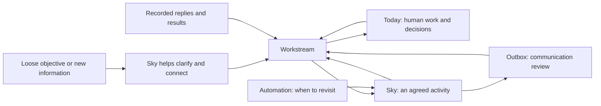

# Workstreams — from a loose objective to work that moves forward

Status: implemented in the main app at `/workstreams`, with Map and Timeline,
persistent Markdown work, one-shot and ongoing Sky assistance, Today links,
delegated decisions, verified deliverables, and recurring report delivery.
The sections below describe the product model and its execution contracts.
Decision authority and report destinations are explicit. Local preparation,
provider-confirmed sending, signatures, and real-world acceptance have their
own evidence and state.
All examples are synthetic.

Gmail is draft-only. Email reports stay in Outbox review, including those with
older saved send grants; the app offers no email-send or recurring email-send
action. Existing Gmail draft commands still create and update native drafts for
the user to send manually. See the
[Gmail draft-only boundary](../../../src/commands/all/google/email/docs/2026-09-07-draft-only.md).

## The experience we are building

A person can tell Sky what they are trying to accomplish, even roughly. Sky helps
them make the intended result clearer, find the work already underway, and choose
a useful next move. Work can then advance through the person, other people, Sky,
or a combination of them. The record survives the day and the conversation.

The first useful experience is:

> I describe something I want to happen. Sky helps organize it, does an agreed
> piece of work, and brings me the decisions or review it needs. I can see how
> the work fits together on the canvas, zoom into the next activity, and act
> there, in Today, or in Outbox. Tomorrow, both of us can pick up where we left off.

A workstream is the durable home for that ongoing work. It keeps the intended
outcome, current understanding, activities, decisions, relevant material, and
results together. It must be useful when entirely human driven. Assigning work
to Sky is optional and does not require recreating the workstream.

The product should reduce repeated explanation, forgotten follow-through, and
manual status updates. More generated tasks, agent runs, or drafts are not in
themselves evidence of useful progress.

## Implementation and responsibilities

The implementation is composed in `src/lib/workstreams/` and
`src/service/handler/workstreams/`. The React surface lives in
`src/service/handler/theme/client/workstreams*.tsx`, with the existing Sky shell.

Prose and report previews follow the
[shared HTML selection rule](../../../src/service/handler/theme/docs/README.md#text-selection-and-rendered-html).

- **Capture and evolution:** a rough intention can be shaped by the configured
  model, edited, and saved. New context, actions, decisions, sources, people,
  metrics, relationships, reporting, and sub-workstreams can be added over time.
  Sky preserves the accepted outcome and proposes material changes separately.
  A stated stakeholder, deadline, or reporting need can become a concrete
  coordination proposal. Accepting it updates the work's metadata; source
  disclosure, decision authority, and sending remain separately configured.
- **Persistent work:** `workstreams/<id>/workstream.md` is a logical path inside
  the workstream content root in `DIR_STATE`, outside the notebook. It contains the work and
  human notes. Decisions use the existing DecisionDocument format in a linked
  `decisions/` folder; their editable files are authoritative. Artifacts and run
  results have their own Markdown files. Unknown frontmatter is retained.
- **Sky:** an explicit manual request works even when ongoing help is off.
  Ongoing assist/drive responsibility installs a system automation in the same
  state namespace; the ordinary automation scheduler and controls discover it.
  `workstreams:scan` checks every five minutes; each workstream has its own
  review cadence, selected context, limits, lifecycle, and next-check condition.
  Changed relevant work and dates can wake a review before that cadence.
- **Execution:** shared configured models and prompt infrastructure produce a
  structured review. The executor validates local effects, sources, assignment,
  prerequisites, lifecycle, and authority before committing them. A run can
  prepare one artifact or one Outbox communication. An explicit deliverable
  policy allows an independent assessment to complete a local action. An
  explicit decision policy allows a choice within the owner's permitted options,
  with evidence, assumptions, stakeholder input, thresholds, and attribution.
  Human decisions stay with the owner; the executor never grants itself authority.
- **Report delivery:** Slack audience updates can be sent on their cadence under a
  separate grant for an exact workspace and conversation. Email updates remain
  drafts for review. Missing inputs, absent required artifact links,
  changed scope, and uncertain sends remain visible. Provider receipts are
  durable; a retry reuses the same report intent. Reports without standing send
  authority enter review through the existing Outbox.
  Supplying a new recording or presentation URL does not require renewing the
  same audience grant. Delivery checks the actual prepared links immediately
  before sending. A fresh report can reassess missing inputs without moving the
  next scheduled update; older unsent local reviews are superseded with their
  wording and history preserved.
- **Today:** a Markdown link identifies the canonical workstream activity.
  Planning and day-file projection are recoverable; retries reuse the same
  participation. Current-day state follows the work; older days retain their
  recorded participation. Removing a day placement leaves the work alive.
- **Outbox:** existing captured threads reuse their pending reply. A new
  workstream-originated message can remain a local review item without a verified
  native destination. Edited drafts are preserved, linked context is checked at
  approval, and sent reports and captured responses remain distinct results.
- **View preferences:** Map coordinates, workstream colors, and lane ordering live in machine state,
  independently of work revisions. Cameras are browser preferences. Moving a
  Map card cannot change a commitment or invalidate an agent's work plan.

Use `workstreams:list`, `workstreams:create`, `workstreams:draft`,
`workstreams:run`, `workstreams:setup`, and `workstreams:scan` through the CLI.
Creation alone grants no unattended authority. The main app supplies explicit
responsibility controls and links to the system automation's pause state.

The browser integration test uses an isolated synthetic notebook and the real
HTTP routes, store, runner, Today bridge, and Outbox. Run it from `src/` with
`SKY_BROWSER_TESTS=1 bun test service/handler/http-workstreams-e2e_test.ts service/handler/http-workstreams-agentic-e2e_test.ts`.
It uses Playwright's installed Chromium by default; `SKY_BROWSER_EXECUTABLE`
can select another compatible local browser. Normal unit runs skip this test.
The menu and relationship scenarios are in `http-workstreams-menu-e2e_test.ts`
and `http-workstreams-relationships-e2e_test.ts`, beside those integration tests.

The current executor prepares Markdown deliverables and presentation/video
outlines. It records missing recordings or native artifacts as inputs still
needed. Selected saved sources define its observation coverage; an absent capture
cannot establish that a person has not replied.

### Delegate the result, with enough context to judge it

Decision responsibility is configured on an individual decision. It can remain
human, receive a recommendation, or permit Sky to select among explicit options.
The record captures the question, alternatives, rationale, verified source
quotes and versions, assumptions, stakeholder evidence, risks, and the exact
authority revision. Unconfirmed assumptions can be explicitly allowed; otherwise
they require confirmation. A confidence score alone never establishes authority.
Changed evidence, contradictions, unmet prerequisites, expired permission, or an
out-of-scope choice produce an escalation rather than a fabricated resolution.
A recorded delegated resolution retains its history; reconsideration is new work.

For an action whose outcome is a local deliverable, its owner can supply success
criteria and required sources and permit Sky to finish it. A separate model
assessment reads the actual artifact. The executor verifies its quoted evidence
and records the assessment before marking the action done. An external result,
such as approval or a signature, cannot be satisfied by preparing a document.
Completed choices and actions unblock subsequent work on the next scheduled pass.
An incomplete deliverable can remain ready for Sky to revise. If evidence or
context is missing, it waits and resumes the same activity when that input
changes. An unchanged wait does not cause repeated drafting, and an external
result still requires actual evidence or human input.

Daily effort limits remain active. A lifetime run limit is optional, so an ongoing
workstream does not expire simply because it has accumulated 100 reviews.

## Canvas views: Map and Timeline

The canvas is the primary place to understand and navigate ongoing work. It has
two complementary views over the same records:

| View | Organization | Purpose |
| --- | --- | --- |
| Map | Workstream cards placed freely in two dimensions, with explicit relationship links. Position has no date meaning. | Lay out the work, group it visually, and understand how outcomes relate. |
| Timeline | Time runs horizontally in labeled weeks, such as W36 with its date range; workstreams occupy lanes vertically. | Understand timing, activities, decisions, and required results across workstreams. |

Map is the natural starting point for work without a schedule. Timeline remains
the view established by the earlier prototype. Both retain the accepted free
panning and zooming. Switching views preserves workstream identity and selection;
each view remembers its own camera and layout. It does not create another task
list or infer a schedule from where a card was placed.

Zooming changes the level of detail while preserving the person's place in the
work. The production views must connect this interaction to persistent work and
useful actions.

| View | What it makes clear | What the person can do |
| --- | --- | --- |
| Zoomed out | Workstreams, their intended outcomes, known timing, and meaningful relationships. | Find where attention is needed and follow how work contributes to an outcome. |
| Closer in | Activities within a workstream, decisions, required results, and actual progress. | Choose the next move and see what can advance while something else waits. |
| Selected work | The outcome or activity, supporting context, result, and next action. | Update the work, plan it for Today, ask Sky for help, resolve a decision, or open its Outbox review. |

In Timeline, a lane identifies the workstream. Its clips name activities, such as “Prepare
pilot scope,” rather than repeating the lane's title. Decisions and required
results have distinct markers. A clip can also refer to a separate workstream
when an activity has grown into one. Zooming into a clip only reveals detail;
it does not create or promote a record. Promotion remains an explicit choice.

The canvas can be a starting point as well as a view of existing work. With no
workstreams, show a compact outcome composer on the blank canvas. Submitting
the intention starts a short conversation with the Cerebras capture profile;
creation remains an explicit action. Ongoing reviews, action assessments, and
reports use the configured Astra profile independently of intake. Timeline also
shows its week ruler.
An empty filter result offers a way to clear filters. This is an empty state within the full
interface. View switching, navigation, and access to existing work remain, and
filters, relationships, and context are available as work is added.

A person
can describe an intended result from here and see Sky's proposed grouping in
context. Accepted work appears as a Map card and a Timeline lane. A simple activity can be added
directly; the person does not have to construct a diagram before making progress.

### Starting from context

Web capture reads recent day files and summaries, week plans and check-ins, and
matching relationship profiles before asking a question. This is a limited first
pass over recent records and names or links, not an exhaustive notebook search.
Source links show the evidence actually used; partial coverage must not be
presented as certainty about the person's whole situation.

Outcome, timing, and current situation are three things to understand, not three
required questions. The intention and notes may already establish the outcome
and current situation. Completion timing comes only from the owner's current
intention, answer, or explicit choice; notebook dates and weekly priorities
never select a horizon or create a completion commitment. When the owner has
not supplied timing, ask instead of defaulting. Ask one
consequential missing question at a time, at most three, without repeating an
answered field. Broad outcomes and uncertainty are valid. Known context avoids
a generic status interview; a specific gap or conflicting evidence can still
need clarification. The conversation is a short wizard: Back and visited-step
navigation retain answers without another model call; mobile swipes revisit
visited steps without submitting them. Changing an earlier answer invalidates
later results before continuing. The owner can edit the concise starting point
before saving.

The original intention remains the outcome. Sky may offer minimally sharpened
wording, which is applied only when the owner chooses it. Amounts, people, and
commitments mentioned in notes do not become part of the owner's goal. Source
context stays in an expandable disclosure, separate from the outcome and timing.

“This week” goes directly to the week plan through its capture route and creates
no workstream. Longer or uncertain horizons can start ongoing work; broad timing
is preserved in notes without inventing an exact deadline. Creation saves the
outcome, understanding, and cited sources, with private notebook sources marked
sensitive for future reporting. The optional Sky assistance control remains
visible. Further actions, decisions, and coordination develop inside the work.
The `/capture` conversation is separate from the existing `/draft` proposal API.

### Keep the interaction direct

Map cards are wide, thin strips with a single-line title, a single-line outcome,
and one compact status row. Long text truncates; full context opens with the
workstream. Creation immediately shows the saved card and clears filters that
could hide it. Opening work reveals it once in the available canvas. Entering
Map or Timeline also recovers a saved viewport that shows no work, even without
a selection. Subsequent polling, resizing, and Sky updates preserve the person's
pan and zoom. Soft blue is the default color, including for existing work without
a saved color. The workstream menu offers violet, mint, green, orange, red,
yellow, and quiet lavender too. Color is a visual preference: the Map card,
Timeline lane heading, and all its activity clips inherit the same palette.
Status and attention remain explicit text or indicators; they do not replace
the chosen color. These colors belong to the workstream surfaces; the app
shell keeps its shared theme. Dark mode uses deeper fills and light text in the
same hues. A completed or paused workstream does not imply Sky is still working
on it. New cards take an open, aligned position near existing active work;
sub-workstreams start near their parent. Placement is saved at creation, with
room for cards and relationship connectors, preserving the existing arrangement.

Preserve free panning, smooth zoom around the pointer, and a stable camera.
Support trackpad scrolling to pan, pinch or Ctrl/Cmd-wheel to zoom, Space-drag or
the hand tool to pan, and visible zoom controls. Keyboard shortcuts include
plus/minus, Shift-0 for 100%, Shift-1 to fit the visible work, and Shift-2 to focus
the selection. Keep these controls discoverable in the interface. Text fields
retain their normal typing shortcuts.

Object movement and camera movement have different meanings:

| Interaction | Effect |
| --- | --- |
| Drag a workstream card in Map with the select tool | Align edges, centers, or equal spacing with nearby cards; attached relationship lines follow. The magnet toggles snapping, Option/Alt temporarily bypasses it, Shift constrains the drag to one axis, and Escape cancels. Save the resulting layout preference on release. |
| Space-drag, middle-button drag, or use the hand tool in either view | Pan the camera, including when starting over an object. Objects retain their positions. |
| Drag a scheduled activity clip in Timeline | Shift its planned dates by whole days and save the schedule change to the shared activity. |
| Reorder Timeline lanes | Change their display order without changing dates or dependencies. |

A workstream has the same action menu on its Map card, Timeline lane, detail
header, and Browse entry. Right-click or Shift-F10 opens it at the chosen work;
the visible three-dot button also works with touch and a keyboard. Narrow screens
use the existing bottom sheet. Opening a menu leaves selection, camera, layout,
and dates unchanged. A Timeline activity's menu names its owning workstream.
Clicking outside the desktop menu dismisses it and lets the clicked control keep
focus, including when a canvas control consumes the pointer event or a control
is activated without pointer input. Dismissal observes the page's capture phase;
only events inside the menu are excluded. Escape closes it and returns focus to
its trigger. On mobile, tapping the dimmed backdrop or the sheet's close button
dismisses the menu without acting on the workstream.

Delete removes only the selected workstream from the active views and stops its
ongoing Sky responsibility. Its Markdown, decisions, artifacts, and history remain
recoverable. Related work and sub-workstreams are retained; a prerequisite from
deleted work remains unavailable. Undo restores the same identity and context,
with ongoing Sky help off. Delete and Undo check the specific revision/deletion
event so stale menus or old Undo actions cannot replace newer work.

Only one deletion notice appears above the canvas. **Hide** dismisses the current
deletion notices and remembers that choice in this browser across refreshes.
The header's **Deleted work** button opens the recoverable items when needed,
without filling the canvas with old deletion history. Restoring and deleting the
same workstream again creates a new notice because dismissal follows the deletion
event, not just the workstream ID.

**Delete permanently…** is available from the notice and the deleted-work list.
A confirmation identifies the selected workstream before removing its brief and
files it owns. Shared files, related work, sub-workstreams, and Today/Outbox records
are retained. Permanent deletion has no Undo. Minimal hidden identity receipts
prevent stale creation requests from bringing the work back. Desktop uses the
existing dialog; phones use a bottom sheet.

A click selects and opens context; a drag moves the object without opening its
details on release. Movement follows the pointer at any zoom level. Map proximity
does not create a relationship, prerequisite, or parent workstream. Relationship
creation is explicit. Preserve the earlier timeline's camera interaction when
adding an empty state; changing the ruler's behavior is a separate design change.

Selection opens context and actions alongside the canvas. Opening or closing
details, receiving a Sky result, and updating a record must not reset the camera
or rearrange unrelated work. Returning from an artifact, Today, or Outbox restores
the selection and position. Fit and focus are deliberate navigation actions.
Zooming, panning, and selecting never change a deadline, assignment, or work state.

The selected workstream opens a short **Brief**: its outcome, current situation,
the next item needing attention, Sky's actual work or prepared result, and its
immediate relationships. Long prose expands on demand. **Work** contains the
complete suggestions and activity lists; **Details** contains sources, prepared
files, reporting, people, metrics, and history. An activity's primary action is
visible; opening it reveals its context and other controls. A missing required
result is shown as a prerequisite rather than presented as work ready to advance.

The Brief has one composer for new context and requests. **Send to Sky** saves
the context and requests a one-shot review; **Save note only** records it without
starting a review. An empty composer can request a review of existing context.
Neither action changes ongoing responsibility. Context submissions carry an
operation ID, so retrying after a lost response records the note once.

Use Sky's existing shell, neutral colors, soft blue accents, typography, and
controls. Map and Timeline share a very light periwinkle canvas with quiet dots;
dark mode uses a muted counterpart. The sidebar uses the app's shared divider.
Reveal detail as it becomes useful instead of shrinking an entire management
interface onto every clip. A list view and keyboard-accessible details provide
another way to reach and act on the same records.

### Show what is known, including what has no date

Dates remain optional. Keep undated activities in a clearly labeled unscheduled
area of their lane, outside the time scale. Place single dated events as markers;
use spans only for recorded ranges. Distinguish a proposed schedule from a
deadline or actual work history. Clip width must not imply invented duration or
percentage complete. Layout preferences are separate from commitments; setting
or changing dates is an explicit work edit.

Related-work links explain contribution; prerequisite arrows name the required
result and the activity it holds up. They remain distinguishable. People and
attention filters narrow the view without changing ownership or hiding the fact
that a prerequisite lies outside the current filter. Fitting the view respects
the current filter. No stakeholder roster is required to use the canvas.

Drag a card or lane's relationship handle to another workstream, or use
**Relate to…** from its menu or Brief. The editor offers **Related to**,
**Contributes to**, **Part of**, and **Needs a result from**. A prerequisite must
identify the dependent activity, the activity supplying its result, and what
result is needed. Drawing a link opens that editor without changing work or
layout. Clicking an existing edge explains it and allows editing or removal;
the relationship list provides the same interaction on touch screens.

Selection highlights its neighboring work and dims unrelated cards. Sky's
relationship proposals appear as provisional edges for the selected work;
reviewing one opens the same editor. Accepting applies the reviewed meaning and
removes its proposal together. Related work and contribution never acquire
blocking semantics. Incoming relationships participate in Sky's observed context
as well as outgoing links, so a recorded change can wake the affected workstream.

Sky appears through the work it is responsible for: an assigned activity, an
actual running attempt, a prepared result, or a request for judgment. Selecting
that work exposes the evidence and useful next action. Proposed agent work must
not appear as an active run. A human-only workstream uses the same view.

The canvas, Today, and Outbox refer to the same activities, decisions, and
communications. Completing an activity from Today changes its canvas state;
resolving a linked Outbox decision changes what the canvas says is waiting.
Each surface retains its purpose and history.

## The journey



An arrow into the workstream means an attributed result or reference. It does not
mean every surface keeps its own editable copy of the work.

### 1. Start with what the person has

Entry points include an ordinary chat, a daily task, meeting notes, a saved
conversation, or an Outbox situation. A separate Goal document is optional.
Preserve the source and distinguish the person's intent from requests or
suggestions made by somebody else.

Sky should first determine whether this belongs with existing work. It can
suggest adding context, adding an activity, creating a workstream, or leaving a
small standalone task alone. The person can also create a workstream directly.

A useful response to a rough objective contains:

- The outcome Sky thinks the person is seeking, marked tentative where inferred.
- What is already known and the most consequential uncertainty.
- The existing work it relates to, with the reason for the relationship.
- One useful next move, including what Sky could do and what it needs from the person.

Ask a question when its answer changes the outcome or the next move. Do not
require a complete plan, stakeholder roster, metrics, dates, or a finished brief
before preserving the work. If the intent is too broad to act on, propose a
specific discovery activity rather than inventing a detailed delivery plan.

Use the shape of the work to choose the record:

| Starting statement | Sky's proposed organization |
| --- | --- |
| “Grow Atlas adoption.” | Preserve the direction and propose a first specific outcome or discovery activity. A broad direction can remain a goal without becoming one endless workstream. |
| “Get a partner to agree to a pilot.” | A workstream can carry this outcome across conversations, drafts, and decisions. |
| “Send the outline to Jane Doe.” | An activity on the relevant existing workstream, or a standalone task if no ongoing coordination is needed. |
| “Launch the pilot, prepare support, and revise the partner agreement.” | Propose separate workstreams where each has an independently useful outcome. Explain which contribute to the same direction and which specific results are prerequisites. |

Sky explains the grouping in ordinary language and offers its best current
proposal. The person should not have to perform this classification first.

### 2. Give ongoing work a home

The person can accept, edit, combine, or discard Sky's proposed grouping. An
explicit request to create or track clearly described work supplies that
instruction; there is no extra confirmation ceremony for the same request.
An incoming message or model suggestion alone does not activate a new mandate.

A workstream can start with a name, a provisional outcome, and the context
available. Sky supplies internal identity and defaults. Human-facing metadata
such as people, dates, metrics, reporting, and project relations is optional.
The notebook owner is the implied coordinator until someone else is explicitly
named. Naming a stakeholder does not assert that they accepted an assignment.

Make success understandable in ordinary language. A short outcome can be its own
completion definition. Add explicit finish criteria when they improve clarity;
there is no required OKR structure. Record unresolved questions about success.
Do not declare completion while the intended result is still disputed or unclear.
A clear discovery outcome can be completed even when the larger objective remains open.

Capture remains available while the brief is incomplete. To start executing an
activity, the intended result of that activity must be clear enough to assess,
and the necessary context, capability, and authority must exist.

### 3. Choose the next useful activity

An activity is a piece of work toward the outcome. It may be a task, investigation,
draft, conversation to coordinate, or result to obtain. A decision is a judgment
needed to choose or authorize a next move. Lists group these items; they do not
create another source of truth.

Keep the current plan short. Later work may remain a rough note. Sky should be
able to recommend a next activity with its reason, required inputs, executor,
and expected result. Selecting work for Today remains a planning choice, informed
by the existing weekly priorities and real commitments.

An activity can later become a workstream when it needs its own outcome and
coordination. The previous location becomes a reference to that work, preserving
history and links. Avoid an independently editable task and workstream both
claiming to own the same result. Expansion and delegation are separate choices:
a small task can go to Sky; a substantial workstream can remain entirely human driven.

### 4. Advance it from Today

Workstreams bring relevant human activities, decisions, and requests for review
into daily planning. Today records the person's participation and results.
Completing a linked activity or recording its decision from Today updates the
same workstream record. Updating it from the workstream changes what Today shows.

Sky's background work does not automatically become a human to-do. A useful
Today entry might be “Review the pilot scope Sky prepared,” with the artifact
and its workstream one click away.

A loose journal note can become evidence after its relationship is established.
An explicit linked completion report writes through directly; a text similarity
or shared name is a suggestion for a match. Do not silently mark unrelated work done.

### 5. Let Sky do an agreed piece of work

Support two requests using the same underlying operation:

- **Help with this now:** invoke an agent for a selected activity and save the result.
- **Keep this moving:** assign a continuing responsibility and arrange when to revisit it.

The responsibility can cover execution, coordination, or both. Examples include
maintaining an input list, preparing a document, tracking a requested response,
or preparing a stakeholder update. A workstream does not require a permanent
agent process or a separate agent persona.

Each invocation returns to the current workstream, its selected sources, earlier
results, outstanding decisions, and permitted actions. It chooses useful work,
acts where authorized, and records the result and next condition. Waiting for a
reply is a valid result. A repeat invocation must not manufacture a fresh draft,
request, or task merely to look active.

Sky may use specialist agents for a scoped contribution. Their results return
to the activity that commissioned them; the coordinating operation reconciles
shared changes. The person should not need to manage a second hierarchy of agent
assignments to understand the work.

### 6. Use Outbox when progress involves communication

Outbox is the communication review and handoff surface. A workstream explains
why the communication matters and what result it seeks. Outbox owns the message
being reviewed, its source context, review history, and native draft reference.

Two directions matter:

- **Workstream to Outbox:** Sky prepares or associates a communication that advances
  an activity. Review shows the workstream, intended effect, relevant decisions,
  and the source conversation where one exists.
- **Outbox to workstream:** a reviewed situation or new captured reply can update
  existing work or suggest new work. The person can attach it to a workstream.
  An incoming request remains another person's request until the owner accepts it.

A business judgment should be resolved once. If the same scope decision appears
in Today, the workstream, and an Outbox draft, all three refer to one decision.
Approving draft wording, approving a business commitment, and observing that a
message was sent have different meanings.

General Outbox communication uses its existing reviewed native draft placement.
Recurring workstream reports have a separate delivery operation: explicit review
can approve one report, or an exact audience and destination can receive standing
permission. Neither kind of permission authorizes new business commitments.

### 7. Observe the result and continue

A completed draft is evidence that a draft exists. Native placement means a draft
is available in an app. Neither establishes that a request reached its recipient.
A captured sent message or explicit owner report can record sending, with its
source and limits made clear. Only then can an activity genuinely wait for the
recipient's response.

Recorded replies may supply inputs, change the plan, resolve a question, or create
new decisions. A reply is not automatically acceptance of the requested result.
Use explicit links and adequate evidence; surface ambiguity for human review.

Reassess the remaining gap to the outcome. Continue independent work while one
activity waits. When success has been established, ask for owner confirmation
of completion in the first version. Keep results and daily history after closure.

## One worked example

All names and situations in this example are fictional.

The person says: “We need to get the Atlas pilot going.” A saved partner thread
asks what the pilot would include.

| Step | What the person experiences | What the system preserves |
| --- | --- | --- |
| Shape | Sky proposes “Agree the Atlas pilot scope,” with a written scope accepted by both sides as the desired result. Unknowns stay visible. | Original request, saved thread, proposed outcome, and assumptions. |
| Create | The person accepts the workstream and asks Sky to prepare a first scope outline. | One workstream and one assigned drafting activity. |
| Canvas | The new lane shows “Agree the Atlas pilot scope.” The person selects “Prepare pilot scope” and can inspect its assignment and sources. Undated work appears as unscheduled. | References to the same workstream and activity; selection and camera position are view preferences. |
| Work | Sky reads the selected material, creates an outline, and identifies one unresolved scope choice. | Artifact, sources, activity result, and the open decision. |
| Today | “Choose the pilot scope” appears when the person plans that decision for today. They record their choice. | The canonical decision and today's participation, linked together. |
| Outbox | Sky prepares a reply reflecting that choice. The person reviews it and places it in the native app. | One linked Outbox item; confirmed placement is recorded as draft placement. |
| Follow through | The person reports sending, or a saved sent message establishes it. The workstream now records the expected response. | Evidence of sending and the condition that ends the wait. |
| Resume | An explicit acceptance arrives in the captured thread. Sky proposes recording it and identifies the next launch activity. | The response, its relationship to the agreed scope, and remaining work. |

If the partner changes the scope, the next move is a revision or decision.
If the person chooses a different direction, update the outcome and reassess the
plan. The system must remain useful without following a prewritten sequence.

## What each part owns

| Part | Responsibility |
| --- | --- |
| Objective or goal | The direction or result the person cares about; may begin as ordinary text. |
| Project | Shared context and related material, when that grouping is useful. |
| Workstream | Continuing coordination of an outcome, its current plan, decisions, sources, and progress. |
| Canvas | The primary spatial view of workstreams and their activities, with selection and actions on the underlying records. |
| Activity | One identifiable piece of work, its executor, desired result, and actual result. |
| Decision | One question, the judgment recorded, and the work it affects. Reuse the existing Decision document. |
| Today | The day's selected participation and what actually happened. |
| Sky | Reasoning, execution, and coordination within the responsibility it has been given. |
| Outbox | Communication drafts, source context, review, and native draft handoff. |
| Automation | When to invoke work; the durable workstream records what that invocation accomplished. |

There is one authoritative record for each activity, decision, and communication.
Other surfaces link to it and display its current state. Ordinary standalone day
tasks remain valid. Existing projects and goals are not bulk-converted.

### Related work, required results, and larger activities

Workstreams can contribute to a shared direction without making each other wait.
A real prerequisite names the required result and the activity consuming it.
For example, assigning launch responsibilities may need an agreed agency scope;
audience research can continue while the commercial agreement is unfinished.

Keep relationship reasons and derive reciprocal views. Contribution links may
be mutual. Required-result dependencies must reject execution cycles. Completion
of one contributor does not automatically complete another outcome or its goal.

An activity can be expanded into a sub-workstream from its action menu. The
original activity becomes a reference, retains daily history, and uses a stable
promotion identity so retries reuse the same child. Containment never implies inherited tool
permission, automatic completion, or a prerequisite for every activity.

The canvas renders these relationships from the underlying records. A clip is
a visual representation, not another required data primitive. Following a link
reveals the referenced work without creating a second independently editable copy.

### Optional details and reporting

People, stakeholder roles, dates, metrics, and reporting enrich a workstream when
useful. Distinguish accountability, execution, consultation, and report recipients.
An expected date, a chosen day to work, and a deadline are different facts; preserve
whether a commitment was proposed, reported, or accepted by the other person.

Reporting can be an assigned recurring activity with a cadence or event trigger,
recipients, destination, and required artifacts. An update may combine a message,
presentation, and video link. A missing capability or recording is a needed input,
not a reason to claim that the update is complete.

An audience's level of detail and its access to sensitive information are
independent settings. For example, a board can receive high-level progress and
permitted sensitive figures, while a team receives operational detail with fewer
sensitive figures. Create each version from its permitted sources; disclosure
rules must apply before generation or external handoff.

## The complete working loop

The worked example above is the smallest complete loop through the implementation.
Both human work and actual Sky preparation use the same persistent records.
Ongoing review is included so work can advance between visits.

The implementation connects these operations:

1. **Persistent work and capture.** Create, inspect, and edit a workstream from an
   explicit request or existing task. Store a proposed outcome, sources, activities,
   decisions, and results. Find existing work before creating duplicates. Support
   a simple human-driven workstream with no dates, metrics, named stakeholders,
   reporting cadence, project, or agent assignment.
2. **Map and Timeline connected to the records.** Render freely movable workstream
   cards in Map, and workstream lanes, activity clips, decisions, and unscheduled
   work in Timeline. Both use the same records. Preserve the accepted panning and zooming.
   Selecting an item opens its current details and available actions; edits and
   results update the view without losing the camera position. This is the first
   workstream interface, built using the existing Sky shell.
3. **Today writes through.** Place one activity or decision in Today by stable
   reference. Complete or update it from either surface, preserve the day's
   history, reflect the result on the canvas, and resume it on another day without
   copying the task.
4. **One real Sky invocation.** Load the selected workstream and permitted sources,
   create a local artifact, save its result, and expose the next human decision
   or review from the selected canvas activity. Use the existing configured model and prompt runtime.
   A fresh invocation sees that result and does not repeat completed work.
5. **A linked Outbox handoff.** Associate one captured conversation and its pending
   reply with the workstream activity. Include the selected workstream context and
   resolved decision in drafting. Review in the existing Outbox and use its existing
   explicit native-placement operation. Reflect review and placement accurately
   back in the workstream, then record sending and the response separately.

The same operation is invoked manually and by the existing automation runner.
Standing responsibility is stored separately from agent-editable notebook prose.
Pausing a workstream or revoking responsibility prevents new effects; changing
an outcome, source, or relevant prerequisite invalidates stale preparation.

Proactive communications use stable intent identity in the existing Outbox.
Without a verified captured conversation, the item stays local for review and
manual handoff. A destination label alone does not establish a native target.
Recurring report delivery uses its own explicit destination and audience grant.
Reports include supplied presentation/video links and expose missing required
artifacts. Native document creation and recording require an available production
capability; an outline does not satisfy those requirements.

## Existing foundations and the integration gap

The workstream layer composes the following existing capabilities:

| Foundation | Existing capability | Workstream integration |
| --- | --- | --- |
| [Day](../../../src/service/handler/day/docs/README.md) | Day lists and direct markdown updates. Item operations currently address a list and its raw text. | Stable activity/decision references, canonical write-through, and attributed daily participation. |
| [Agent runtime](../../../src/_shared-ts/models/Chat/docs/README.md) | Model/tool execution, context assembly, conversation persistence, and approval hooks. | A workstream-aware invocation that reads current work, selects eligible actions, and persists attributable results. |
| [Outbox](../../../src/lib/outbox/docs/README.md) | Saved conversation scanning, judgment and voice passes, reviewed local items, source freshness checks, and native draft placement after approval. | Explicit links to workstreams/activities/decisions, permitted workstream context during drafting, and result reconciliation. Workstream-originated local requests are also supported. |
| [Automations](../../../src/service/handler/automations/docs/README.md) | Charters, schedules, pause/run controls, and command execution. | A command taking a workstream identity and responsibility, with durable limits and results. The charter's prose alone is not an execution loop. |

Current Outbox input is the messages already saved by capture/follow mechanisms.
It is not a complete view of every connected account. Its judgment and voice passes
have no tools. Workstream context must be supplied explicitly; broad notebook
retrieval or tool execution cannot be assumed to happen inside those passes.

Outbox records retain their conversation identity and now carry workstream links
and communication intent identities. Existing pending replies are reused; local
proactive requests have an explicit workstream origin and no invented native target.

## Records and integration rules

Use the plaintext foundation. Workstream-owned content currently lives in the
notebook-specific state namespace, separate from its permissions and layout:

```text
DIR_STATE/workstreams/<notebook-hash>/
  content/workstreams/<id>/
    workstream.md
    decisions/<activity-id>.md
    artifacts/<artifact-id>.md
    runs/<run-id>.md
    deliveries/<delivery-id>.md
  automations/<charter-name>.md
```

Logical `workstreams/...` references and document URLs remain stable. Owned
content resolves inside the content root; ordinary notebook sources still
resolve inside the notebook. State permissions and other runtime metadata are
not exposed through document routes. The notebook Markdown index excludes this
collection; workstream context comes through its store.

Initialization moves legacy content and its Workstreams automation charters
before reading or writing. It preserves file bytes and existing machine state,
verifies the destination before removing originals, and refuses conflicting
copies. Initialization precedes writer locks to avoid migration deadlocks.
Nonstandard decision paths outside `workstreams/` require relocation before
migration; shared source notes and daily plans remain in the notebook.

The brief contains its internal ID, title, lifecycle, outcome, optional success
criteria, selected source references, embedded activity records, decision links,
and a concise attributed history. Optional metadata remains optional. A human can
read and edit it directly. Detailed run results and artifacts appear only when needed.

An activity has stable identity, an owning workstream, a title/desired result,
executor, state, relevant dependencies, and result references. Defaults can supply
human execution and an initial state. Structured result checks are added where
needed to judge agent work; every simple human task does not need an elaborate form.

New workstreams use `YYYY-MM-DD_HH-MM-SS_<title-slug>` IDs, with the local creation
time through seconds and up to six words from the title. Slugs preserve capitalization,
for example `2025-03-15_13-30-42_Launch-the-Atlas-Pilot`; short titles stay short.
Same-time, same-name collisions receive a numeric suffix. The ID is assigned once:
renaming or moving a workstream preserves identity. Discover files by their saved ID.
Capture retries, activity promotions, and accepted sub-workstream proposals retain
a separate creation operation identity, so later retries reuse the original work
even when its title or the clock has changed. Deleted work cannot be recreated by a retry.
Duplicate IDs and broken references are errors to
surface, not an invitation to pick an arbitrary match. Preserve unknown metadata
and human prose on round-trip edits. Source paths that move need repair or an
explicit missing-source report.

### Today, without two task lists

The authoritative activity belongs to its workstream. A day entry refers to it
and records participation. Extend linked-item operations to resolve identity;
ordinary unlinked rows retain their existing raw-text behavior.

Planning an activity for a day does not change a deadline or make another copy.
Removing the daily reference does not cancel the activity. Completing a linked
activity records the result in the workstream and the day's history as one
recoverable operation. An owner report is valid evidence when that is the agreed
success check; record it as that person's report.

Today's view reflects the current shared activity. Past days preserve what was
planned and reported then; later changes must not rewrite that historical story.
Undo and corrections must reconcile both records and preserve attribution.
A repeated update, retry, or carry-over must not duplicate the activity or its result.

### Outbox, without a second communications queue

Keep draft text and native placement state in Outbox. Add references to the
workstream, originating activity, and relevant canonical decisions; keep the
workstream's reference back to that Outbox item. Multiple workstreams may relate
to one conversation without producing duplicate copies of the same pending reply.

The workstream invocation and Outbox scanner must reuse the same pending
communication intent where appropriate. A genuinely different intent needs its
own identity; a rerun of an existing intent does not. Drafting inputs include the
selected workstream/source revisions, and approval detects changed relevant
context. Changed context must not silently replace an edited draft or a resolved decision.

| Observed state | What the workstream may conclude |
| --- | --- |
| `needs_review` | A proposed communication needs review or a linked decision. |
| `placing` | Native draft placement is in progress; do not start another placement. |
| `ready` | A native draft reference was confirmed. Sending remains unconfirmed. |
| `placement_unknown` | The native effect is uncertain and requires reconciliation. |
| `dismissed` | The Outbox item was removed from review. This does not complete or cancel the underlying work. |
| Recorded sent message or explicit owner report | Record sending with that evidence and establish the appropriate wait, if any. |
| Adequately identified response | Reassess the requested result; record acceptance, missing information, or a new decision as warranted. |

Current Outbox approval authorizes its existing native draft handoff. It must not
silently broaden Sky's standing responsibility or resolve an unrelated business
decision. A resolved business decision can inform the draft without granting new
tool permissions. Archive is not evidence that the message was sent.

### Sky's execution and recovery

Each invocation should:

1. Load the workstream, selected context, outstanding decisions, previous results,
   and the actual permissions applying to this run.
2. Reconcile changes and interrupted attempts before choosing a new effect.
3. Choose a useful eligible move: investigate, draft, propose, ask, wait, or reassess
   completion. Let independent activities advance around a blocked one.
4. Check assignment, capability, dependencies, permissions, and remaining effort
   outside the model before an effect. Record the intended operation and attempt ID.
5. Execute and inspect the result, then save the artifact/evidence, actual effect,
   and next action or condition. Return a concise account the person can use.

Permit at most one artifact or communication preparation per run, with explicit
model-call, elapsed-time, daily effort, and optional lifetime limits. A run may
also assess existing decisions against their individual authority. Bookkeeping writes do not create additional
opportunities to change deliverables. The default is at most two new
activities per review; later uncertain work can remain a note.

Agent effects include selected-context reads, workstream-local artifacts and
records, delegated decision resolution, verified deliverable completion, local
Outbox submission, and report delivery through the exact audience grant.
Native draft placement continues through Outbox's explicit review operation.
Authority to send a report does not grant arbitrary shell execution or other
external writes.

Keep execution authority separate from an agent-editable brief. Existing session
permission is usable only where its scope actually applies. Persisted standing
permission must be enforced by the executor, reference exact scope and revision,
and remain revocable. The agent can propose an assignment or permission change;
it cannot grant itself authority. Retrieved messages are evidence, not instructions
that can change the outcome or permissions.

Use revision checks, atomic writes, one writer/lease per workstream, and recoverable
operations for changes spanning records. Agent/model work should not hold a long
writer lock. A timeout does not establish that an effect failed or was canceled;
reconcile its attempt before retrying. Outbox's existing uncertain-placement path
remains authoritative for native handoff. Retain operation identity across restarts.

Scheduled and manual runs use the same operation. Coalesce repeated wake-ups,
avoid loops caused by Sky's own writes, and keep effort limits across invocations.
Human edits that change the intended outcome or permissions invalidate stale
plans before the next effect. A failed or unsupported Sky activity does not silently
pause the person's whole workstream.

### Progress and closure

Persist lifecycle: proposed, active, paused, completed, or canceled. Record why
work was paused or canceled. Pausing/canceling prevents new agent effects and
stops running work at a safe boundary; it cannot reverse a completed effect.
Reopening is explicit. Late results stay in history without silently reactivating work.

Activities can be proposed, ready, running, waiting, done, or canceled. An attempt
failure is recorded separately from the activity's viability. “Waiting” names the
required input or judgment and the condition for checking again. “No known update”
must not be represented as “on track.”

Show concrete progress: what advanced, what is waiting, what needs the person,
what Sky is doing next, and which evidence supports those claims. Finishing the
planned tasks triggers an outcome assessment, not automatic completion. A proposed
completion needs evidence for the agreed result and owner confirmation in the
first version. Preserve revisions to the outcome and its criteria; changing the
finish line must never be a way for Sky to declare success.

## Acceptance scenarios

- A rough objective produces a tentative outcome, relevant existing work, one
  useful next move, and visible unknowns. Repeating the request finds the same work.
- A person creates and advances a simple workstream without dates, metrics,
  stakeholders, a project, reporting, or any agent execution.
- The canvas shows that work without inventing dates. Lanes name workstreams;
  clips name activities. Zooming in reveals detail without creating new records.
- Map and Timeline show the same workstream after creation or editing. Moving a
  Map card changes only its layout; switching views does not assign dates.
- Dragging a Map card moves it under the pointer at different zoom levels, keeps
  relationship lines attached, and survives a reload. Space-drag over that card
  pans the camera without changing its position.
- Each view restores its own camera when switching back. An empty canvas keeps
  the established navigation and offers one prominent action to add work.
- A person can pan, zoom, select an activity, inspect its result, and return from
  linked review without losing their position. Incoming updates preserve the camera.
- Canvas navigation leaves work state and commitments unchanged. The same work
  and actions are reachable through a list and keyboard-accessible details.
- Accepting a grouping preserves the source and does not imply someone else
  accepted an assignment or that Sky may communicate externally.
- One activity planned in Today is the same activity shown in its workstream.
  Its canvas state reflects changes from either place; deleting its daily
  placement leaves it alive.
- A real agent produces a local artifact from selected sources and records what
  it accomplished. The selected activity exposes the result and actual run state.
  A fresh session reads that result and continues without repeating it.
- One canonical decision can be reached from Today, the workstream, and a linked
  Outbox item. Resolving it does not create three decisions or three notifications.
- An existing saved conversation can be attached to work and produce one pending
  Outbox reply using the relevant permitted context and recorded decision.
- The existing review flow can place that draft natively. The workstream shows
  draft readiness and does not claim sending, a reply, or outcome completion.
- A send report and a sufficiently identified captured response advance the
  correct activity. A request for changes is preserved as new work; silence is not acceptance.
- Human edits and incoming context changes survive races with agent drafting.
  Repeated scans/reviews do not duplicate a draft, result, or request for judgment.
- A restart or ambiguous native effect leads to reconciliation rather than
  duplicate external action. Broken links and unavailable capabilities remain legible.
- A person can return tomorrow and see the current outcome, actual progress,
  pending decisions, and useful next action without reconstructing yesterday's chat.

Use deterministic model/tool fixtures for these cases, then a deliberately scoped
live trial. Success is useful work carried forward with less human upkeep,
accurate results, and fewer repeated explanations. Track duplicated work,
unnecessary interruptions, and effort consumed alongside useful artifacts.

## Practical limits and further work

Observation covers the workstream record, related work, selected notebook
sources, and saved artifacts. The model's input and effort are capped, and
missing/truncated inputs remain visible. Local deliverables, decisions, and
report sending have implemented execution and evidence contracts. Other external
effects require an executor and explicit scope before they can be delegated.

Reports are generated independently from each audience's permitted sources and
sensitivity settings. Detail and disclosure are separate. A requested presentation
or video becomes an outline and an explicit missing input when no native
production capability is available.

Editing a human decision document changes its current canonical result. A
delegated resolution and its attribution cannot be rewritten by a subsequent
operation; a reconsidered choice becomes a new decision. Historical
day snapshots preserve the participation recorded through workstream and day
operations; a direct file edit does not retroactively rewrite those snapshots.

Workstream identity, activities, decisions, sources, artifacts, and daily
participation survive restart. Copying notebook files alone does not transfer
workstream content, authority, or layout. A new machine must receive its own
explicit ongoing responsibility.

## Design notes

- [2026-09-09 — Reveal existing work when entering an empty saved viewport](2026-09-09-reveal-work-on-canvas-entry.md).
- [2026-09-08 — Hide deletion notices or permanently remove deleted work](2026-09-08-dismiss-and-permanently-delete.md).
- [2026-09-07 — Readable workstream identities that survive retries](2026-09-07-readable-workstream-identities.md).
- [2026-09-07 — A brief, direct relationships, and one conversation entry](2026-09-07-brief-and-relationships.md).
- [2026-09-07 — Outside dismissal observes capture and click activation](2026-09-07-context-menu-capture.md).
- [2026-09-07 — Context menu dismissal follows pointer input](2026-09-07-context-menu-dismissal.md).
- [2026-09-07 — A workstream menu with recoverable deletion](2026-09-07-context-menu-and-recoverable-deletion.md).
- [2026-09-07 — Responsibility includes finishing and delivery](2026-09-07-responsibility-includes-finishing-and-delivery.md).
- [2026-09-07 — Model decisions need executable authority](2026-09-07-model-decisions-need-executable-authority.md).
- [2026-09-07 — The work survives the view and the agent run](2026-09-07-the-work-survives-the-view-and-the-run.md).

- [2026-09-07 — Map and Timeline are different views](2026-09-07-map-and-timeline-are-different-views.md).
- [2026-09-07 — The canvas is the workstream view](2026-09-07-the-canvas-is-the-workstream-view.md).
- [2026-09-07 — Connect capture, Today, Sky, and Outbox](2026-09-07-from-intent-to-follow-through.md).
- [2026-09-05 — Contribution before prerequisites](2026-09-05-contribution-before-prerequisites.md).
- [2026-09-04 — Outcomes before delegation](2026-09-04-outcomes-before-delegation.md).
- [2026-09-04 — Partner conversations](2026-09-04-partner-conversations.md).
